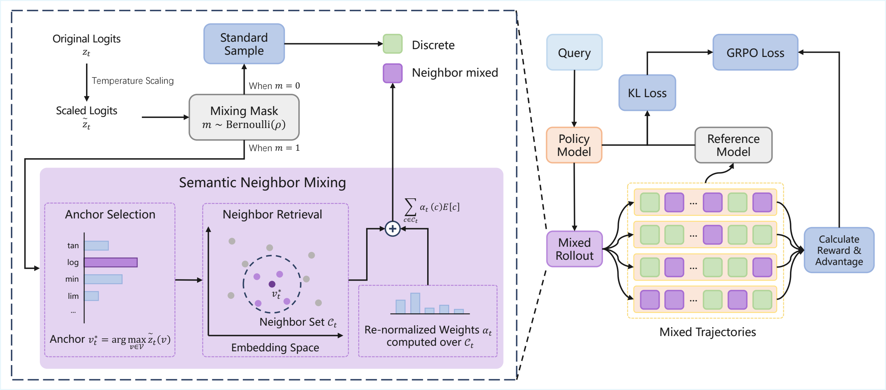

# N-GRPO: Embedding-Level Neighbor Mixing for Enhanced Policy Optimization

[](https://arxiv.org/abs/2606.10768)
[](#quick-start)
[](#license)

##  Overview

N-GRPO is a reinforcement learning framework for large language model reasoning. It extends GRPO with Semantic Neighbor Mixing, an embedding-level rollout strategy that mixes an anchor token embedding with its nearest semantic neighbors in the vocabulary. This encourages diverse reasoning trajectories while keeping exploration close to the local semantic manifold.

<p align="center">
  
</p>

##  Quick Start

###  Installation

First prepare a working `verl` environment following the official verl installation guide.

```bash
# After activating your verl environment:

cd my_verl

pip install math-verify
pip install -e src/sglang-0.4.6.post5/python
pip install --no-deps -e src/verl
```

###  Dataset

All datasets are converted to verl-style parquet files.

```bash
export DATA_ROOT="$PWD/data/verl_data"

python src/data_prepocess/deepscaler.py --local_dir "$DATA_ROOT/DeepScaleR-Preview-Dataset"
python src/data_prepocess/aime24.py --local_dir "$DATA_ROOT/aime24"
python src/data_prepocess/aime25.py --local_dir "$DATA_ROOT/aime25"
python src/data_prepocess/amc23.py --local_dir "$DATA_ROOT/amc23"
python src/data_prepocess/math_500.py --local_dir "$DATA_ROOT/math_500"
python src/data_prepocess/gpqa_diamond.py --local_dir "$DATA_ROOT/gpqa_diamond"
```

The expected data layout is:

```text
data/verl_data/DeepScaleR-Preview-Dataset/train.parquet
data/verl_data/aime24/test.parquet
data/verl_data/aime25/test.parquet
data/verl_data/amc23/test.parquet
data/verl_data/math_500/test.parquet
data/verl_data/gpqa_diamond/test.parquet
```

###  Model

Download a Hugging Face compatible base model. The main experiments use DeepSeek-R1-Distill-Qwen backbones.

```bash
export MODEL_ROOT="$PWD/models"

huggingface-cli download deepseek-ai/DeepSeek-R1-Distill-Qwen-1.5B \
  --local-dir "$MODEL_ROOT/DeepSeek-R1-Distill-Qwen-1.5B"

huggingface-cli download deepseek-ai/DeepSeek-R1-Distill-Qwen-7B \
  --local-dir "$MODEL_ROOT/DeepSeek-R1-Distill-Qwen-7B"
```

###  Training

The configs already include the default data paths, model paths, rollout settings, and trainer settings. Override paths only when your local layout is different.

Run N-GRPO:

```bash
PYTHONUNBUFFERED=1 python -m verl.trainer.main_ppo \
  --config-dir=configs \
  --config-name=n-grpo_1_5b.yaml
```

Run GRPO:

```bash
PYTHONUNBUFFERED=1 python -m verl.trainer.main_ppo \
  --config-dir=configs \
  --config-name=grpo_1_5b.yaml
```

If needed, override local paths from the command line:

```bash
PYTHONUNBUFFERED=1 python -m verl.trainer.main_ppo \
  --config-dir=configs \
  --config-name=n-grpo_1_5b.yaml \
  actor_rollout_ref.model.path="$PWD/models/DeepSeek-R1-Distill-Qwen-1.5B" \
  data.train_files="$PWD/data/verl_data/DeepScaleR-Preview-Dataset/train.parquet" \
  "data.val_files=[$PWD/data/verl_data/aime24/test.parquet]" \
  trainer.default_local_dir="$PWD/outputs/n-grpo_1_5b"
```

Export a trained checkpoint to Hugging Face format:

```bash
python -m verl.model_merger merge \
  --backend fsdp \
  --local_dir "$OUTPUT_DIR/global_step_<STEP>/actor" \
  --target_dir "$PWD/outputs/hf_n-grpo_1_5b_step_<STEP>"
```

###  Evaluation

Single-benchmark evaluation example:

```bash
export DATA_ROOT="$PWD/data/verl_data"
export MODEL_PATH="$PWD/outputs/hf_n-grpo_1_5b_step_<STEP>"
export EVAL_DIR="$PWD/outputs/eval/math500"
mkdir -p "$EVAL_DIR"

PYTHONUNBUFFERED=1 python -m verl.trainer.main_ppo \
  --config-dir=configs \
  --config-name=eval_1_5b.yaml \
  trainer.resume_mode=disable \
  trainer.validation_data_dir="$EVAL_DIR" \
  actor_rollout_ref.model.path="$MODEL_PATH" \
  "data.val_files=[$DATA_ROOT/math_500/test.parquet]" \
  2>&1 | tee "$EVAL_DIR/eval.log"
```

Evaluate all benchmarks listed in `scripts/eval_all.sh`:

```bash
MODEL_PATH="$PWD/outputs/hf_n-grpo_1_5b_step_<STEP>" \
CONFIG_NAME=eval_1_5b.yaml \
OUTPUT_ROOT="$PWD/outputs/eval_all" \
bash scripts/eval_all.sh
```

##  Citation

```bibtex
@misc{zhu2026ngrpo,
  title={N-GRPO: Embedding-Level Neighbor Mixing for Enhanced Policy Optimization},
  author={Zhu, Xukun and Yu, Hang and Di, Peng and Zhu, Linchao},
  year={2026},
  eprint={2606.10768},
  archivePrefix={arXiv},
  primaryClass={cs.CL},
  url={https://arxiv.org/abs/2606.10768}
}
```

##  Acknowledgements

This repository builds on and benefits from several excellent open-source projects and resources, including `verl`, `sglang`.

##  License

The bundled `verl` source is licensed under Apache-2.0; see `src/verl/LICENSE`. The bundled SGLang source keeps its upstream license files. Please check the licenses of the base models and datasets before redistribution.
